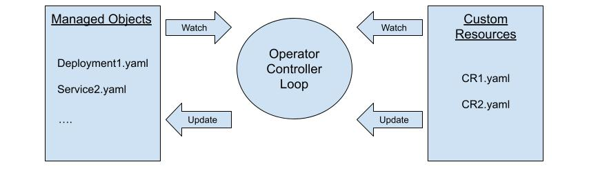
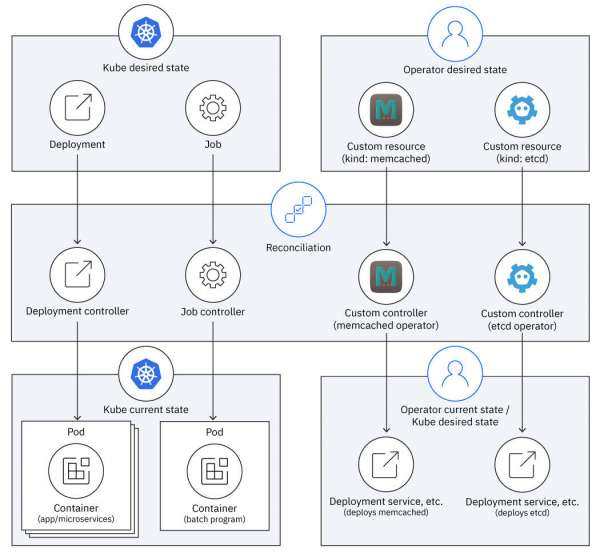
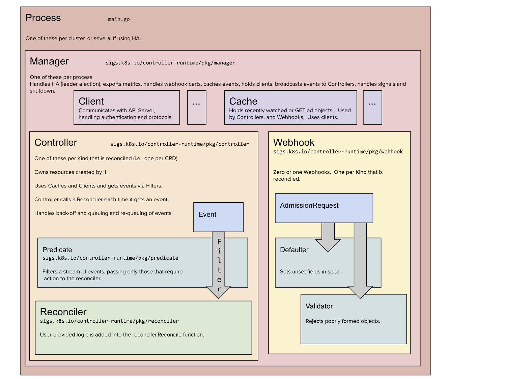

# Creating Operators using Operator-SDK

## What are Operators?

It is an automated version of a Kubernetes admin user providing a power to create, configure and manage workloads on instances of Kubernetes-Native Applications running on Kubernetes Clusters. 

Operators are Kubernetes utility which provides the Kubernetes user an extension to create, configure and manage instances of complex applications using custom functions and configurations managed by custom controller.

Operators are application-specific controller that extends the functionality of the Kubernetes API.

Operators watches Kubernetes Custom Resources(CR) which contains specification data which can be termed as desired state. This desired state is the defacto state the Operator's controller want to achieve for corresponding Managed Objects for that resource.
Operator Controller manages that sync using the *Reconciliation Control Loop*, an existing feature of Kubernetes Controller Manager.

The Control loop in short is just a watch to Kubernetes API by controller manager for checking current state and adjusting that current state accordingly using reconcile function.

The objects(managed) which operators deals with can be:-
- Deployments
- Secrets
- Services
- Ingress
- Config Maps


## How Operators work?

### A block diagram explaining basic operator flow



Operators inherit a Control loop feature from existing Kubernetes Controller Manager which infinitely watches all the resources and objects present in the cluster and triggeres `reconcile()` function of the controllers according to corresponding watches implemented for them.

### Components interacting with operator's controller:-
1. Kuberentes Operator Controller - It is the built in controller managed in Control Plane by Controller manager to perform operations on OPerator objects. So this controller is responsible for the state of Operators configured by user.

2. CR (Custom Resource) - CRs are the Kube API extension mechanism to allow implement watches by controllers to know the desired state of the objects managed by operators.

3. CRD(Custom Resource Definition) - For creating custom resources(CRs), a definition of specification is required which tells kube about what constitutes a CR. CRD is a schema of information a CR can constitute, when Operator Controller deals with a CR it is aware about information using the CRD schema.
CRD is used to provide a functionality to derive a new `kind` which operators can `watch`.

    There are 2 most important information data for a CR to link to corresponding CRD:-

    - kind
    - api-version

    Operators implements watches on CRs using the above fields.

4. Custom Controller - It is the core of an operator and it resides outside of control plane as it is a workload for kubernetes. It constitutes of majorly 3 things:-
    - watches - Tells Kubernetes Controller Manager to trigger a reconcile method for what changes in cluster. Using the kind and api-version descibed above.
    - Reconcile() - This function responds back to kube controller manager about what should be done with the current control loop iteration and how to behave in the corresponding ones.
    - A Managed Object Definition - A managed object is defined dynamically which is returned by the controller as to define the exact desired state of the corresponding pods. I will try to explain managed object more below.
5. Kube API - CRs are behind the API and controllers can't access the CRs directly, they need to access the via API.
6. Managed Objects - This is the final resultant object yaml an operator creates post the reconcile, these managed objects can be any object listed above. These yaml thus are the desired state for the default kubernetes controllers which uses them to derive a balance between this desired state and the current state.

### A block diagram explaining bigger picture of working of operators:-



### Quoting important information from Red Hat reference(https://developers.redhat.com/articles/2021/06/22/kubernetes-operators-101-part-2-how-operators-work):-

Operator controllers work one level of abstraction higher than the Kubernetes controllers. The Kubernetes controllers reconcile built-in kinds like Deployment and Job into lower-level kinds like Pods. Custom controllers reconcile CRDs like Memcached and Etcd into workload kinds like Deployment and Service. So, a custom controller's current state becomes a Kubernetes controller's desired state.

Both kinds of controllers reconcile between the desired and current state, but it takes two rounds of transformation to deploy a workload for an operator's custom resource:

1. The operator’s controller transforms the custom resource into a set of managed resources (that is, the workload) that are the operator’s current state but are also the control plane’s desired state.
2. The Kubernetes controllers transform the managed resources into running pods (aka the operand) in the control plane’s current state.


## Developing Operators

As per above explanation, most of the Operator work is automated, like:-
- Infinite Control loop.
- Trigger a Reconcile Function for the valid watches.
- Actions by existing Kube Controllers for deploying their workloads.

So the operator's core which we care about for it's functionality is Controller code and the kinds which that controller impacts. This kinds are defined by CRD.
So for the functioning of an Operator the most basic components are
1. Controller Code(Operator Itself)
2. CRDs

### Development of Controller code

We can implement an Operator (that is, a Controller) using any language / runtime that can act as a client for the Kubernetes API.

[Here](https://kubernetes.io/docs/reference/using-api/client-libraries/#officially-supported-kubernetes-client-libraries), are the officially supported Kubernetes-Client Library which can be used for writing operator controller code from scratch.

But we usually use already developed SDKs for different languages which are built on top above libraries to provide ready to go boilerplate code.

[Here](https://kubernetes.io/docs/concepts/extend-kubernetes/operator/#writing-operator) are the SDKs available.

For this demo we used [Operator Framework SDK](https://operatorframework.io/)

#### Steps to initiate a boilerplate code for Demo Operator

1. Download and install Operator-SDK:-

    Follow [these](https://sdk.operatorframework.io/docs/installation) steps to download and install Operator SDK.

2. Check version of Operator-SDK:-
    ```
    operator-sdk version
    ```
    Try to match the *kubernetes version* and *go version* on your machine according to the returned versions by above command, for me it returned:-

    `operator-sdk version: "v1.21.0", commit: "89d21a133750aee994476736fa9523656c793588", kubernetes version: "1.23", go version: "go1.17.10", GOOS: "linux", GOARCH: "amd64"`

3. Create a new directory, preferred directory is inside:-

    ```
    mkdir -p $HOME/projects/$OPERATOR_NAME
    cd $HOME/projects/$OPERATOR_NAME
    ```

    If you are creating a project outside of `$GOPATH/src`, you will need to perform 2 additional steps:-
    - Set `export GO111MODULE=on`
    - also during sdk init command we will need to set `--repo` attribute.

4. Perform init:-
    ```
    operator-sdk init --domain [DOMAIN_NAME].com --repo github.com/[DOMAIN_NAME]/[OPERATOR_NAME]
    ```

    This will scaffold a basic project where we can start changing the controller functionality accordingly.

    Above we use 2 options:-
    - domain - this domain will suffix all the API Groups we will be creating next steps, like `<group>.[DOMAIN_NAME]`
    - repo - It is required as scaffolded files requires proper module path.

    The basic boilerplate structure is well explained [here](https://book.kubebuilder.io/cronjob-tutorial/basic-project.html).

    For our quick understanding, important parts of initiated project:-
    - Entry Point - `main.go`
    - All the base config files for deployment of an operator-controller - `config/*`
    - `Dockerfile` for building an operator-controller's image according to the changes present in our developed project
    - `go.mod` - modules required to support our project(requirements)
    - `Makefile` - all the targets for required steps like building image, pushing image, creating manifests, creating bundles, creating catalog and many more.

    Controller is the main code where we want to write a code for performing reconcile code for implemented watches.
    The dependent Go interfaces are listed and explained [here](https://pkg.go.dev/sigs.k8s.io/controller-runtime/pkg).
5. Now we create a kind-apiGroup CRD and a controller for corresponding CRD:-

    ```
    operator-sdk create api --group $GROUP_NAME --version $VERSION --kind $KIND_NAME --resource --controller
    ```

    In the above command, we have 5 options:-
    1. `group` - Remember in step 4 we provided `domain`, so a new API Group will be created with `<group>.<domain>`
    2. `version` - Version helps to identify an object more closely so it is now *apiVersion*:- `<group>.<domain>/<version>`
    3. `kind` - Kind also adds up for the identification of resource which controller need to add a watch upon.

    So now till here we have declared a new CRD which a controller reconcile for.

    4. `controller` - It is the default true option, if true a contoller will be created for the above created CRD.

    5. `resource` - It is the default true option, if true a CR will be created for the above created CRD.

    Let's start reasoning about what changes the above command made to basic structure:-
    - `api/$VERSION` folder created with 2 files:-
        - Version infor file
        - Kind Type File - This define all the fields a CR might have, thus defining a schema of new object we desire to create.
    - `Controller` folder is added with a controller file, it will have 3 functionalities implemented:-
        - Reconcile()
        - Watches
        - Handling of managed object which the controller returns
    - `main.go` modified, to add a manager such that it provides all related variables like client, schema, cache to controller.
    - config files are changed for new CRD and controller management.
    - `CR` samples are created with API Version and kind defined.
    **An Important point to note here is, we are only discussing single API-group controller here for multi-API Group controller visit [here](https://book.kubebuilder.io/migration/multi-group.html)**

    **It is recommended to have a one to one mapping between a controller and an API to manage**

    Here is the architecture the KubeBuilder, which is used by Operator Framework for scaffolding boilerplate, tries to create for an operational controller:-

    

6. At this point we are ready to modify the scaffolded kind type file according to our requirements to add actual fields the CR might contain.

    We do not plan to go into deep for the changes, but here are some basic changes we perform in our operator:-

    - In `api/v1alpha1/memcached_types.go` we define data types for structs status and spec.
    - When done with defining types run `make generate`, this will update `api/v1alpha1/zz_generated.deepcopy.go`
    - Now run `make manifests`, this will create the CRD which define the schema for CR and also add a role which will be binded to controller for performing changes to managed object via Kube API.

7. Now is the point we start changing `controllers/memcached_controller.go`(the actual operator implementation):-
    We added below things to implement a basic operator:-
    - Added *watches* for kind and api version. - [here](https://github.com/rajdeepc2792/memcached-operator-project/blob/d2140b45ef6fa266e2de574ca70a49e8b587797f/controllers/memcached_controller.go#L192)
        - The changes adds a watch on CR according to kind and version
        - Also child deployments are added to the watch.
    - Modified *reconcile()* function, [here](https://github.com/rajdeepc2792/memcached-operator-project/blob/d2140b45ef6fa266e2de574ca70a49e8b587797f/controllers/memcached_controller.go#L59):-
        - Used client to access kube API and performed a change in managed object accordingly like creating deployment when none exists or changing the number of instances of pods if it mismatches the desired state(CR).
        - Change/add RBAC permissions

8. Run `make manifests`, to generate all the required yaml according to the operator changes.

    At this point locally all the manifests are in place. And these manifests can be used to deploy the operator successfully on the local cluster.

9. Now we build and push the operator as an image:-

    ```
    export IMG=[REGISTRY]/[IMAGE_NAME]:[TAG]
    make docker-build docker-push IMG=$IMG
    ```

    this will build and push the docker image to your registry given you have docker service on and login is performed.

10. Now we create a bundle which will be used to for the operator deployment:-
    ```
    make bundle IMG=$IMG
    ```

    this will generate a new folder named bundle and it will contain various yaml which will be needed by OLM(We will cover this in next chapter) to deploy and manage our custom operator

11. Now we deploy the operator using:-

    `make deploy`

12. To undeploy we use:-

    `make undeploy`

13. We usually build and push the operator bundle as an image and then use it with Operator-SDK to deploy it:-

    ```
    export BUNDLE_IMG=[REGISTRY]/[BUNDLE_IMAGE_NAME]:[TAG]
    make bundle-build BUNDLE_IMG=$BUNDLE_IMG
    make docker-push IMG=$BUNDLE_IMG
    ```

    this will build and push the bundle.Docker image to your registry given you have docker service on and login is performed.

14. Deploy operator using operator-SDK:-

    ```
    kubectl create namespace $NAMESPACE_NAME
    operator-sdk run bundle $BUNDLE_IMG --namespace $NAMESPACE_NAME
    ```

15. Cleanup Operator using operator-SDK:-

    ```
    operator-sdk cleanup $OPERATOR_NAME --delete-all --namespace $NAMESPACE_NAME
    ```

16. To check if operator is working:-
    Deploy a CR using [template CR](https://github.com/rajdeepc2792/memcached-operator-project/blob/master/config/samples/cache_v1alpha1_memcached.yaml)

    Check if new pods are created.
    Modify the CR by changing the size field in yaml and re-apply, now check if pods count were changed or not.

    If changes in replicas of pod is happening the operators are working.


## Next

We are using operator-sdk to deploy the bundle here, but the robust way to deploy Operator is via using the OLM mechanisms. We will cover OLM in the next chapter.

## References
- https://developers.redhat.com/blog/2021/02/08/deploying-kubernetes-operators-with-operator-lifecycle-manager-bundles#
- https://docs.openshift.com/container-platform/4.7/operators/operator_sdk/golang/osdk-golang-quickstart.html
- https://developers.redhat.com/articles/2021/06/11/kubernetes-operators-101-part-1-overview-and-key-features#
- https://developers.redhat.com/articles/2021/06/22/kubernetes-operators-101-part-2-how-operators-work
- https://www.redhat.com/en/topics/containers/what-is-a-kubernetes-operator
- https://kubernetes.io/docs/concepts/extend-kubernetes/operator
